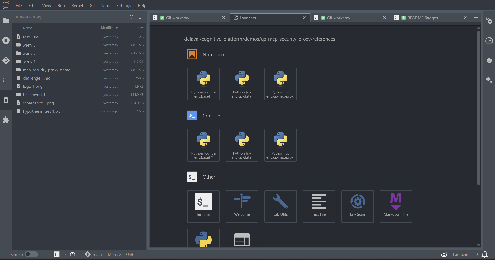

# jupyterlab_trash_mgmt_extension

[](https://github.com/stellarshenson/jupyterlab_trash_mgmt_extension/actions/workflows/build.yml)
[](https://www.npmjs.com/package/jupyterlab_trash_mgmt_extension)
[](https://pypi.org/project/jupyterlab-trash-mgmt-extension/)
[](https://pepy.tech/project/jupyterlab-trash-mgmt-extension)
[](https://jupyterlab.readthedocs.io/en/stable/)
[](https://kolomolo.com)
[](https://www.paypal.com/donate/?hosted_button_id=B4KPBJDLLXTSA)

A dedicated left panel for managing your JupyterLab trash. See what's taking up space, restore files you need, or empty the bin entirely.



## Features

- **Trash panel in sidebar** - Accessible alongside file browser, kernels, git, and extensions panels
- **Storage usage display** - See how much space deleted files occupy
- **Individual item management** - Remove or restore specific files from trash
- **Empty bin** - Clear all deleted files at once
- **Server-side integration** - Python backend for reliable trash operations

## Installation

Requires JupyterLab 4.0.0 or higher.

```bash
pip install jupyterlab_trash_mgmt_extension
```

## Uninstall

```bash
pip uninstall jupyterlab_trash_mgmt_extension
```

---

_This extension was born from the existential dread of watching 47GB of virtual environments slowly consume your disk space while you convince yourself you'll "definitely need that project from 2019 someday." It won't bring back your deleted thesis draft, fix your impostor syndrome, or explain why you have twelve copies of `untitled.ipynb` - but at least now you can watch your poor life choices accumulate in a nicely formatted sidebar panel._
